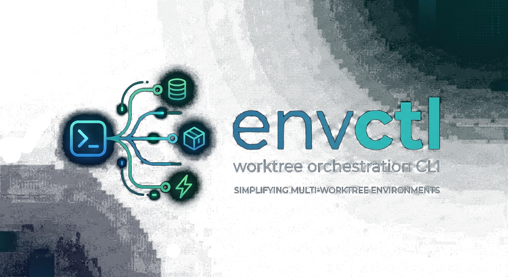

<p align="center">
  
</p>

<h1 align="center">
  <small>Create, test, compare, and spin up full worktree environments with their databases in seconds</small>
</h1>

<p align="center">
  Reinvent your vibe-coding workflow. Spin up many worktrees with correctly wired apps and supporting services, automatic port allocation to avoid conflicts, isolated databases, Redis, Supabase, n8n. one CLI to rule all running frontends and backends, viewing logs, and testing every tree in parallel.
</p>

<p align="center">
  <a href="https://github.com/kfiramar/envctl/releases/tag/1.1.0"></a>
  <a href="pyproject.toml"></a>
  <a href="docs/README.md"></a>
  <a href="docs/changelog/main_changelog.md"></a>
  <a href="docs/developer/contributing.md"></a>
  <a href="docs/license.md"></a>
</p>

<p align="center">
  <a href="docs/README.md"><strong>README</strong></a>
  ·
  <a href="docs/user/getting-started.md"><strong>Getting Started</strong></a>
  ·
  <a href="docs/developer/contributing.md"><strong>Contributing</strong></a>
  ·
  <a href="docs/license.md"><strong>License</strong></a>
</p>

`envctl` is a global CLI for orchestrating full local development environments across one repository and many worktrees. It starts apps, assigns safe ports, wires dependencies, keeps each environment isolated, and gives you one place to operate the whole system.

This is the point where normal local development usually starts breaking down: two backends want the same port, one frontend points at the wrong API, a shared Redis or database leaks across branches, logs are split across terminals, and parallel implementations become difficult to compare safely.

`envctl` turns that into a deterministic workflow. It tracks runtime state per worktree, keeps service and dependency wiring isolated, and gives you a single command surface for startup, tests, logs, health, inspection, PR/review flows, and teardown. The result is faster iteration, fewer environment mistakes, and a much better base for both human and AI-assisted development.

## Quick Start

```bash
# 1) Install envctl once so it is available in every shell
pipx install "git+https://github.com/kfiramar/envctl.git"
pipx ensurepath

# Or install for the current user
python -m pip install --user "git+https://github.com/kfiramar/envctl.git"

# 2) Go to a target repo
cd /path/to/your-project

# 3a) Start the main repo environment
#     Use this when you want one repo-local environment.
#     If .envctl is missing, envctl opens the guided setup wizard.
envctl --main
# 3b) Or work from plans and let envctl manage worktrees for you
#     Use this when you want parallel implementations side by side.
mkdir -p todo/plans/backend
cat > todo/plans/backend/checkout.md <<'PLAN'
# Checkout Implementation Plan
PLAN

envctl --plan
```

That first interactive run is the normal setup path. The wizard writes the repo-local `.envctl` for you, whether you start in `main` mode or jump straight into plan-driven trees.

## What envctl Is For

`envctl` is built to:

- bring up a repo-local environment quickly
- run and compare multiple implementations or worktrees
- keep startup, logs, tests, and inspection behind one CLI
- support high-throughput human and AI-assisted development workflows

## Docs

Start here:

- [Documentation Hub](docs/README.md)
- [Getting Started](docs/user/getting-started.md)
- [First-Run Wizard](docs/user/first-run-wizard.md)
- [Common Workflows](docs/user/common-workflows.md)

User docs:

- [User Guides](docs/user/README.md)
- [Planning and Worktrees](docs/user/planning-and-worktrees.md)
- [Python Engine Guide](docs/user/python-engine-guide.md)
- [FAQ](docs/user/faq.md)

Reference:

- [Commands](docs/reference/commands.md)
- [Configuration](docs/reference/configuration.md)
- [Important Flags](docs/reference/important-flags.md)

Operations and troubleshooting:

- [Troubleshooting](docs/operations/troubleshooting.md)
- [Operations Index](docs/operations/README.md)

Developer docs:

- [Developer Guides](docs/developer/README.md)
- [Debug and Diagnostics](docs/developer/debug-and-diagnostics.md)
- [UI and Interaction Architecture](docs/developer/ui-and-interaction.md)
- [Python Runtime Guide](docs/developer/python-runtime-guide.md)

Project docs:

- [Planning and Roadmaps](todo/plans/README.md)
- [Changelog](docs/changelog/README.md)
- [License](docs/license.md)

## Configuration

`envctl` writes and maintains a repo-local `.envctl`.

- On first interactive use, the setup wizard creates it for you.
- Later, run `envctl config` to reopen the wizard and edit it safely.
- [`docs/reference/.envctl.example`](docs/reference/.envctl.example) is the reference file for managed keys and defaults, not the primary onboarding flow.
