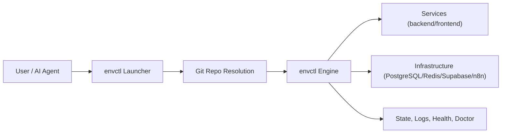

# Architecture

`envctl` is split into a launcher and an engine.

- Launcher: resolves repo context, installs PATH entry, forwards commands.
- Engine: runs orchestration for services, infrastructure, logs, state, health, and diagnostics.

## Determinism
Determinism comes from:
- Consistent CLI entrypoint (`envctl`).
- Explicit mode/target flags.
- Config precedence (`env > .envctl/.envctl.sh > defaults`).
- Saved runtime state with resume flows.

## Dual Engine Transition
`envctl` now runs Python engine by default and keeps shell as an explicit fallback:
- Default: launcher sets `ENVCTL_ENGINE_PYTHON_V1=true`.
- Fallback: set `ENVCTL_ENGINE_SHELL_FALLBACK=true` to force the deprecated shell runtime during migration/cutover.
- Python runtime enforces startup self-checks, normalizes command exit codes, and introduces typed contracts for ports/state/runtime projection.
- The shell engine should be treated as a compatibility path, not a co-primary runtime.

For a deeper developer-oriented walkthrough of the current Python runtime surfaces, see [Python Runtime Guide](python-runtime-guide.md).

### Python Engine Modules
The Python package lives under `python/envctl_engine/`:
- `cli.py`: argument normalization, startup checks, command exit-code contract (`0` success, `1` actionable failure, `2` controlled quit).
- `models.py`: typed dataclasses for `PortPlan`, `ServiceRecord`, `RequirementsResult`, `RunState`.
- `ports.py`: deterministic port planning + lock-file reservation.
- `state.py`: safe JSON state loading and deterministic merge policy.
- `runtime_map.py`: canonical runtime projection with `port_to_service` and `service_to_actual_port`.
- `requirements/*`: shared bind-conflict retry contract across postgres/redis/supabase/n8n.
- `shell_adapter.py`: explicit fallback adapter to the legacy shell engine.

### Shared ownership rules
- UI capability checks are centralized in `ui/capabilities.py`.
- Interactive dashboard command parsing is centralized in `ui/command_parsing.py`.
- Shared interactive target-selection behavior is centralized in `ui/selection_support.py`.
- Textual selector list navigation is shared through `ui/textual/list_controller.py`.
- Prompt-toolkit selector execution is shared through `ui/prompt_toolkit_list.py`.
- Startup and resume support modules own reusable behavior; orchestrators compose them instead of duplicating it.

## Runtime Artifacts
Python runtime writes deterministic artifacts under `${RUN_SH_RUNTIME_DIR}/python-engine/`:
- `run_state.json` (canonical state authority)
- `runtime_map.json` (project/service/URL projection)
- `ports_manifest.json` (requested/assigned/final ports + sources/retries)
- `error_report.json` (structured failure summary)
- `events.jsonl` (structured event log)

User-oriented operations guidance for these artifacts and the debug bundle workflow lives in [Python Engine Guide](../user/python-engine-guide.md).
